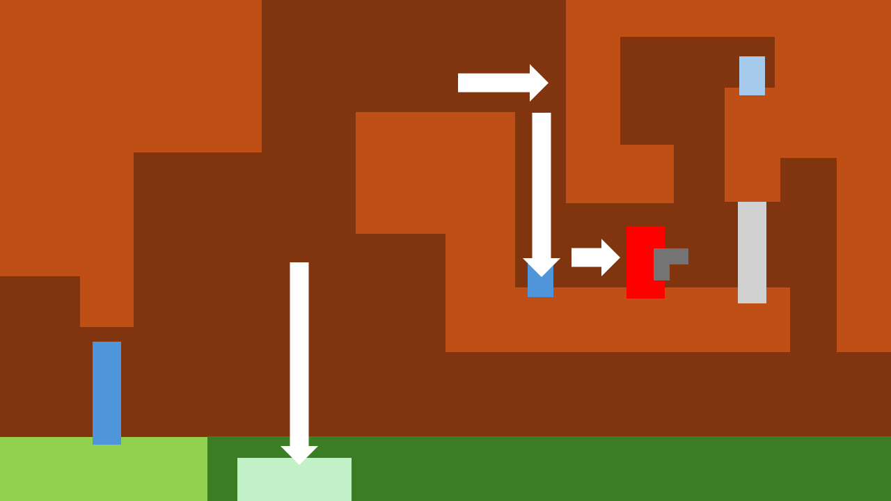

# COMP2150  - Level Design Document
### Name: Audrey Custodio
### Student number: 47301414

## 1. Player Experience (~700 words)
### 1.1. Discovery
**Discovering the mechanics of the weapons**
**Section 1 - Staff**

At the start of the level, I intentionally put the destructible column and chomper next to each other. The purpose of this was so that the player recognises that the staff can be used to destroy things. If it can destroy a destructible column, it would be reasonable to propose that it can also destroy a chomper. By forcing the player to break the destructible column with the staff to progress, it is ensured that they learn this mechanic.

**Section 1 - Gun**

I wanted the player to discover they can use the gun on switches. To achieve this, I presented a problem for the player: a switch that can’t be walked through or jumped to. They will need to find an alternative way of flipping the switch. This is present in two areas of Section 1 and is used to gate progression before the player learns the gun’s mechanics. 
By again trapping the player in a room, they discover that the gun can be used to shoot switches. 
They may then recognise the placement of the switch being similar to the one in the other room, and then use the gun there.
Through this level design, I believe the player engages in the experience of discovery by finding out the dynamic between the gun and switch and recognising the pattern of the layout.

### 1.2. Drama
**Section 1 - Falling**

Since this is towards the beginning of the level, I wanted the player to feel excited to start. I included this falling section to give the player a sense of exhilaration and thrill, similar to how a drop tower ride would.

**Section 2 - Rest room**

In the middle of all the intense platforming and encounters with enemies, I wanted to give the player a break. The room provides health packs and is absent of any dangers.

### 1.3. Challenge
**Section 2 - Optional challenge rooms**

The player can engage in optional challenge rooms that are more difficult than the other route. Each room is dedicated to challenging the player in both platforming and combat, inviting them to showcase their skills in these aspects.

The first room is dedicated to platforming. In this level, players must jump over obstacles as they ride the moving platforms. Completing this challenge requires players to react quickly and maneuver themselves around the limited space they have.

The second room requires the player to be good at platforming and combat. In combat, players will need to dodge enemy spitter bullets and accurately hit enemies while navigating the small platforms provided. Completing this challenge requires players to be precise with their movements and gunshots.

**Section 3 - Final platforming challenge**

For Section 3, I really wanted to explore this idea of a level that’s easy to enter but harder to escape. Initially, it’s easy to hop on stationary platforms and get to the other side. However, when the switch at the end is flipped, all those platforms from before will now be moving, making it considerably harder. Completing this challenge requires players to be fast and precise with their movements so that don’t fall into the acid or hit the spikes.

### 1.4. Exploration
**Section 1 - Two directions**

In the first section, I didn’t want the player to just move in one direction. To get a better sense of exploration, I wanted the player to go back and forth between places and invite the player to explore and take note of distinct landmarks.

I believe the most distinct parts of this section are the parts that gate progression to the next section, Section 2. Which is the trigger door on the left and the acid pool to the right. 
By gating parts of the section, I invite the player to explore and find out how to get past the trigger door and gate.

**Section 2 - Two paths**

I wanted this section to be a bit less linear than the first section, which has optional routes. Multiple paths can give players a sense of freedom. When they’re able to make their own choices, they’re more likely to be invested in the outcomes of those choices and the journey to reaching these destinations while exploring.

I placed two routes for the player, one easy and the other challenging. They both require the player to navigate large spaces through platforming, making it engaging to move around and explore.

| Route without paths | Route with paths |
| ------------- | ------------- |
|  |   | 

## 2. Core Gameplay (~400 words)

### 2.1 Weapon Pickup (Staff) and Destructible Column
| Panel 1 | Panel 2 | Panel 3 |
| :------------- | :------------- | :------------- |
|  |   |  
| The player is trapped in a room with a destructible column blocking the exit. | The player picks up the staff. | The player uses the staff to break the destructible column to exit and progress. They have now learned that the staff can be used to break certain things. |
### 2.2 Chompers
| Panel 1 | Panel 2 |  |
| :------------- | :------------- | :------------- |
|  |   | 
| The player sees the chomper at a distance. Similar to breaking a destructible column, players can “break” an enemy, such as the chomper,  the same way. | A chomper sees the player in sight and then pursues them, intending to attack. | 
| **Panel 3 - Player response 1** | **Panel 4 - Player response 2** | **Panel 5 - Player response 3** |
|  |    |  
| Players may use the staff to defend themselves as a reflex gained from breaking the destructible column earlier. | They may also jump over the enemy. An ample amount of space above the player is made to accommodate jumping. | Alternatively, if they fail to react in time, they may be damaged by the chomper. |
### 2.3 Pass-through Platforms, Switches and Trigger Doors
| Panel 1 | Panel 2 | Panel 3 |
| :------------- | :------------- | :------------- |
|  |   |  
| The player is trapped again, and the only way out is by activating the switch to open the door. | Have it so the player can only get to the switch through the pass-through platform, block off anywhere else. | By activating the switch, the player will be able to open the door right next to it, so there is a direct correlation between the door and the switch for the player. |
### 2.4 Spikes and Health Pickups
| Panel 1 | Panel 2 | Panel 3 |
| :------------- | :------------- | :------------- |
|  |   |  
| The player will fall down into spikes. | Once the player is damaged from the spikes, health pick-ups will be nearby. They may also have the chance to land on them after being damaged. | The player will gain 1 health point by picking it up. |
### 2.5 Acid, Moving Platforms, Checkpoints, and Weapon Pickup (Gun)
| Panel 1 | Panel 2 | Panel 3 |
| :------------- | :------------- | :------------- |
|  |   |   | 
| The player encounters acid, there is a platform for the to jump onto. | The player goes past a checkpoint and jumps onto the (currently stationary) moving platform. They then jump from the stationary moving platform and onto a ledge. | They continue on. | 
| **Panel 4** | **Panel 5** | **Panel 6** |
|  |    |  |
| Once they move to the right, they fall onto the switch that activates the moving platform. The moving platform goes into the acid and can no longer be jumped on. | The player picks up the gun and jumps to a ledge closer to the other switch. | They shoot the switch, and the trigger door opens. |
| **Panel 7** | **Panel 8** |  |
|  |    | 
| They have no choice but to jump into the acid. | They discover they respawn back to the checkpoint. |
### 2.6 Keys
| Panel 1 | Panel 2 | Panel 3 |
| :------------- | :------------- | :------------- |
|  |   |  
| The key will be locked behind a door, implying it has significant value. | To get the key, the player will have to find a switch somewhere to unlock the door. | Only after flipping the switch will they be able to unlock the door and get the key. |
### 2.7 Spitters
| Panel 1 | Panel 2 | Panel 3 |
| :------------- | :------------- | :------------- |
|  |   |  
| The spitter will be on a high ledge that the player cannot get on. The spitter has a height/range advantage against the player. | The player will have to run past the spitter's bullet and utilise a platform to gain height and shoot the spitter. | The player may also jump and hit the spitter with a staff. |

## 3. Spatiotemporal Design
A section on Spatiotemporal Design, which includes your molecule diagram and annotated level maps (one for each main section of your level). These diagrams may be made digitally or by hand, but must not be created from screenshots of your game. The annotated level maps should show the structure you intend to build, included game elements, and the path the player is expected to take through the level. Examples of these diagrams are included in the level design lectures.

No additional words are necessary for this section (any words should only be within your images/diagrams).
 
### 3.1. Molecule Diagram

### 3.2. Level Map – Section 1

### 3.3.	Level Map – Section 2

### 3.4.	Level Map – Section 3

## 4. Iterative Design (~400 words)
Reflect on how iterative design helped to improve your level. Additional prototypes and design artefacts should be included to demonstrate that you followed an iterative design process (e.g. pictures of paper prototypes, early grey-boxed maps, additional storyboards of later gameplay sequences, etc.). You can also use this section to justify design changes made in Unity after you drew your level design maps shown in section 3. 

You should conclude by highlighting a specific example of an encounter, or another aspect of your level design, that could be improved through further iterative design.
