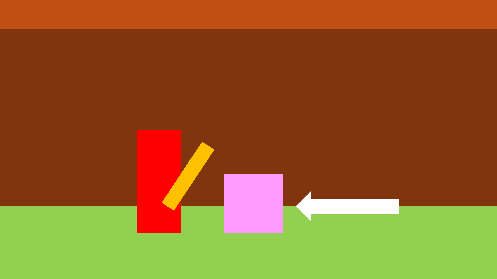

[](https://classroom.github.com/a/YyUO0xtt)
# COMP2150  - Level Design Document
### Name: Audrey Custodio
### Student number: 47301414

This document discusses and reflects on the design of your platformer level for the Level Design assessment. It should be 1500 words. Make sure you delete this and all other instructional text throughout the document before checking your word count prior to submission. Hint: You can check word count by copying this text into a Word or Google doc.

Your document must include images. To insert an image into your documentation, place it in the "DocImages" folder in this repo, then place the below text where you want the image to appear:

```

```

Example:


## 1. Player Experience (~700 words)
Outline and justify how your level design facilitates the core player experience goals outlined in the assignment spec. Each section should be supported by specific examples and screenshots of your game encounters that highlight design choices made to facilitate that particular experience.

### 1.1. Discovery
What does the player learn? How does your encounter and broader level design facilitate learning in a way that follows good design practice?

### 1.2. Drama
What is the intensity curve? How does your design facilitate increasing yet modulating intensity, with moments of tension and relief? 

### 1.3. Challenge
What are the main challenges? How have you designed and balanced these challenges to control the difficulty curve and keep the player in the flow channel?

### 1.4. Exploration
How does your level design facilitate autonomy and invite the player to explore? How do your aesthetic and layout choices create distinct and memorable spaces and/or places?

## 2. Core Gameplay (~400 words)
A section on Core Gameplay, where storyboards are used to outline how you introduce the player to each of the required gameplay elements in the first section of the game. Storyboards should follow the format provided in lectures.

Storyboards can be combined when multiple mechanics are introduced within a single encounter. Each section should include a sentence or two to briefly justify why you chose to introduce the mechanic/s to the player in that sequence.

You should restructure the headings below to match the order they appear in your level.

|  |   |  |  |
| ------------- | ------------- | ------------- | ------------- |
| Description 1 | Description 2 | Description 1 | Description 2 |
|   |   | 
| Description 1 | Description 2 | Description 1 | Description 2 |

### 2.1 Weapon Pickup (Staff) and Destructible Column
| Panel 1 | Panel 2 | Panel 3 |
| :------------- | :------------- | :------------- |
|  |   |  
| The player is trapped in a room with a destructible column blocking the exit. | The player picks up the staff. | The player uses the staff to break the destructible column to exit and progress. They have now learned that the staff can be used to break certain things. |
### 2.2 Chompers
| Panel 1 | Panel 2 |  |
| :------------- | :------------- | :------------- |
|  |   | 
| The player sees the chomper at a distance. Similar to breaking a destructible column, players can “break” an enemy, such as the chomper,  the same way. | A chomper sees the player in sight and then pursues them, intending to attack. | 
| **Panel 3 - Player response 1** | **Panel 4 - Player response 2** | **Panel 5 - Player response 3** |
|  |    |  
| Players may use the staff to defend themselves as a reflex gained from breaking the destructible column earlier. | They may also jump over the enemy. An ample amount of space above the player is made to accommodate jumping. | Alternatively, if they fail to react in time, they may be damaged by the chomper. |
### 2.3 Pass-through Platforms, Switches and Trigger Doors
### 2.4 Spikes and Health Pickups
### 2.5 Acid, Moving Platforms, Checkpoints, and Weapon Pickup (Gun)
### 2.6 Keys
### 2.7 Spitters

## 3. Spatiotemporal Design
A section on Spatiotemporal Design, which includes your molecule diagram and annotated level maps (one for each main section of your level). These diagrams may be made digitally or by hand, but must not be created from screenshots of your game. The annotated level maps should show the structure you intend to build, included game elements, and the path the player is expected to take through the level. Examples of these diagrams are included in the level design lectures.

No additional words are necessary for this section (any words should only be within your images/diagrams).
 
### 3.1. Molecule Diagram

### 3.2. Level Map – Section 1

### 3.3.	Level Map – Section 2

### 3.4.	Level Map – Section 3

## 4. Iterative Design (~400 words)
Reflect on how iterative design helped to improve your level. Additional prototypes and design artefacts should be included to demonstrate that you followed an iterative design process (e.g. pictures of paper prototypes, early grey-boxed maps, additional storyboards of later gameplay sequences, etc.). You can also use this section to justify design changes made in Unity after you drew your level design maps shown in section 3. 

You should conclude by highlighting a specific example of an encounter, or another aspect of your level design, that could be improved through further iterative design.
